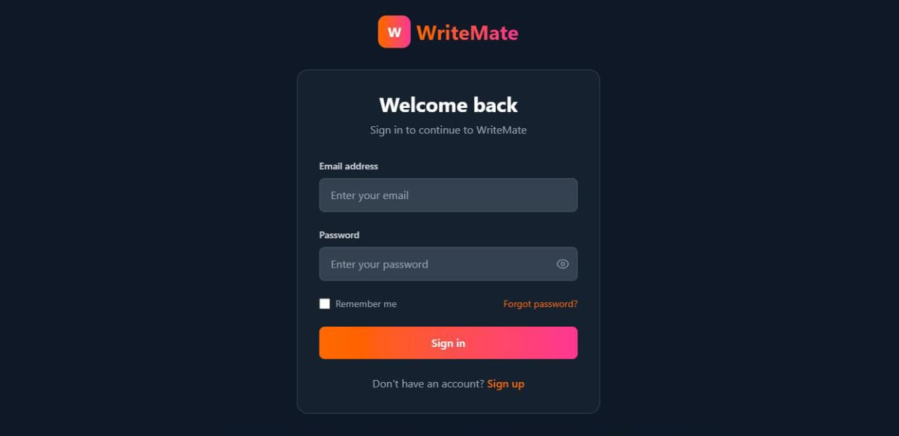
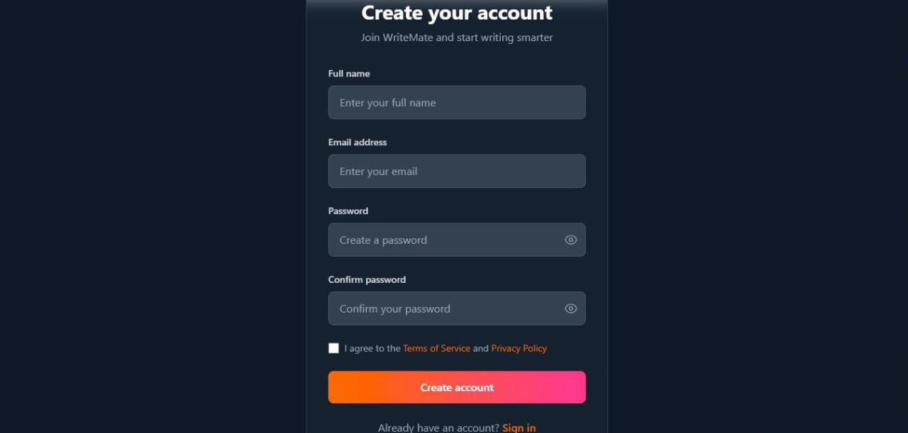
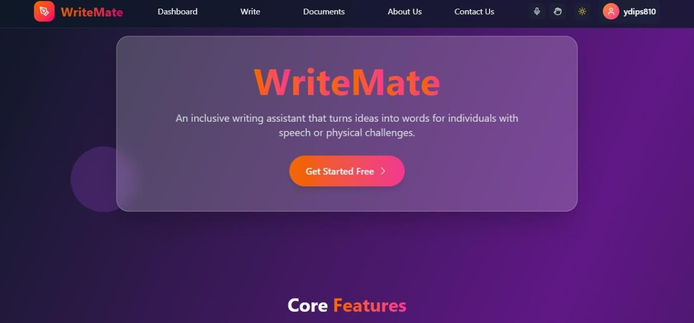
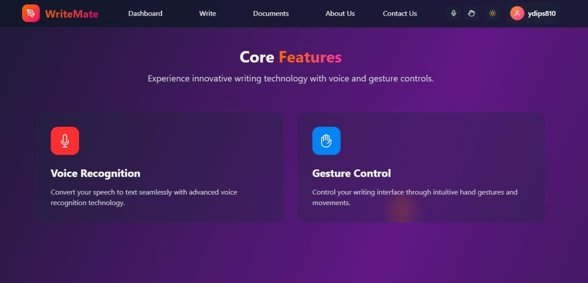
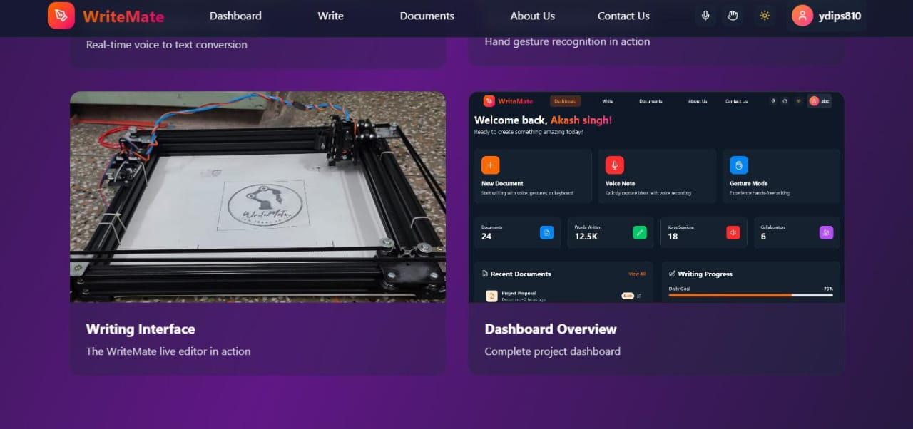
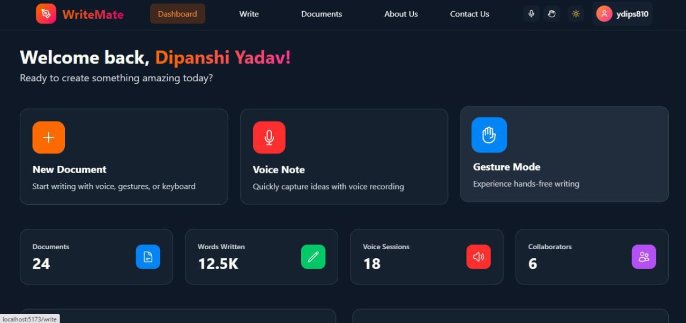
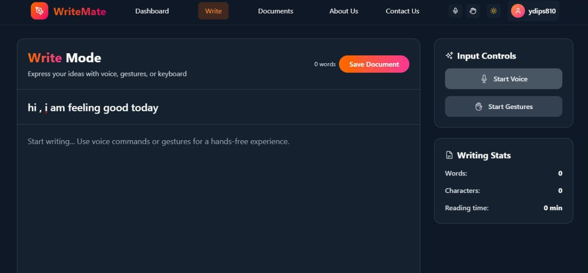
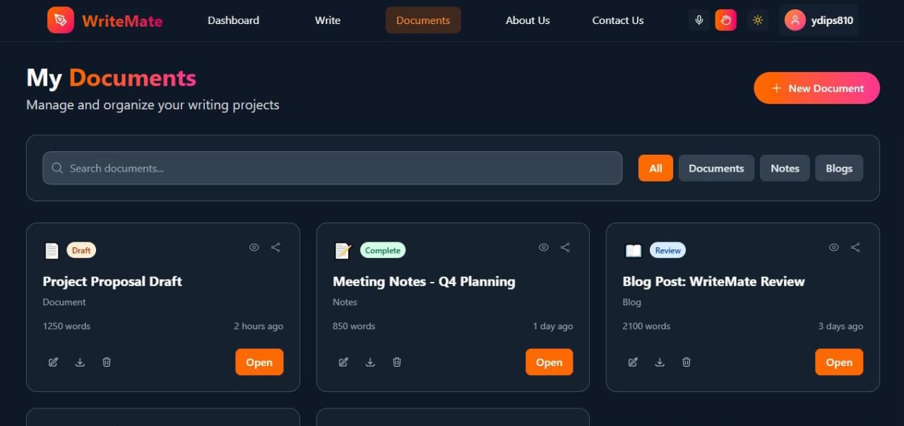
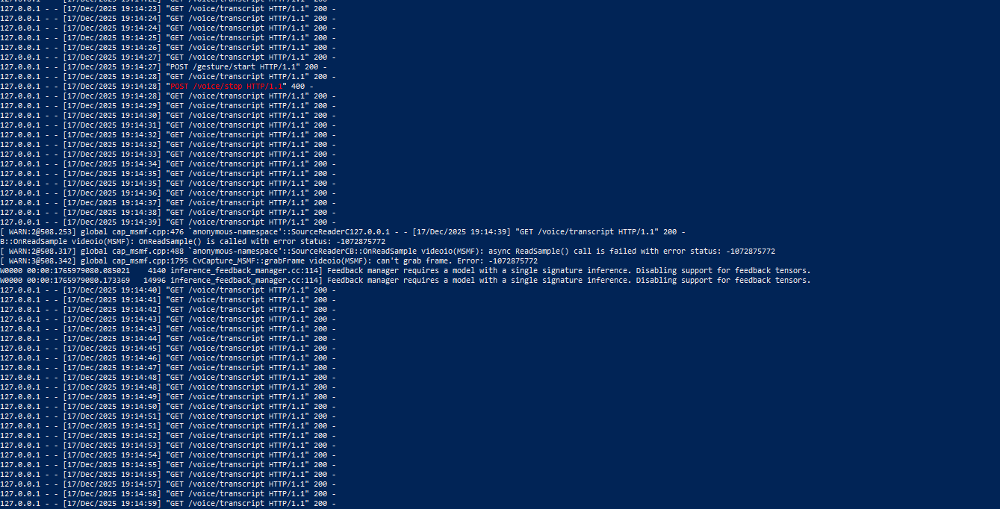

# ✍️ WriteMate  
**Demo:** https://youtu.be/hYa2_TbZQ0w?si=911J33nuItAsphPe *(Timestamp: 18:28)*

> Assistive writing technology enabling independent writing for people with physical disabilities.

---

## 📌 Overview

**WriteMate** is a **patent-published hardware + software project** that enables users to write independently using **voice input** or **Indian Sign Language (ISL)**.

Input is processed using **machine learning on Raspberry Pi 5**, converted into text, and physically written on paper using a **CNC machine**.

This repository showcases the **software system**, including the **frontend UI and backend services** developed by me.

---

## 🚀 Features

- 🗣️ Voice-to-Text input  
- ✋ Indian Sign Language (ISL) gesture recognition  
- ✍️ CNC-based physical writing on paper  
- 🧠 On-device ML processing (Raspberry Pi 5)  
- 🌐 Web interface for user interaction  

---

## 🧩 My Contribution

> Team project (hardware + ML)

- Designed and developed the **complete frontend UI**
- Built and integrated **Python backend services**
- Connected ML outputs with the web interface
- Implemented dashboards and writing workflows

---

## 🖼️ Screenshots

### Frontend UI

#### Authentication
<p align="center">
  
  
</p>

#### Homepage & Landing
<p align="center">
  
  
  
</p>

#### Dashboard & Writing
<p align="center">
  
  
  
</p>

### Backend Output



---

## 🛠️ Tech Stack

**Frontend:** React (Vite), Tailwind CSS  
**Backend:** Python, Flask  
**ML / CV:** OpenCV, MediaPipe  
**Hardware:** Raspberry Pi 5, CNC Machine  

---

## ▶️ Run Locally

```bash
# Clone repository
git clone https://github.com/dipanshi8/WriteMate-Main.git
cd WriteMate-main

# Backend setup
python -m venv venv
venv\Scripts\activate
pip install -r requirements.txt
python Python/backend_file.py

# Frontend setup
cd frontend
npm install
npm run dev
